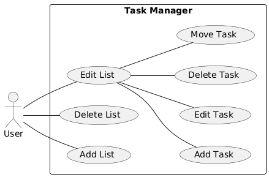
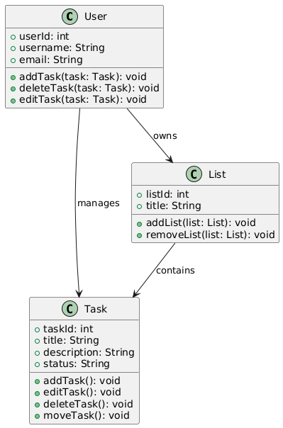
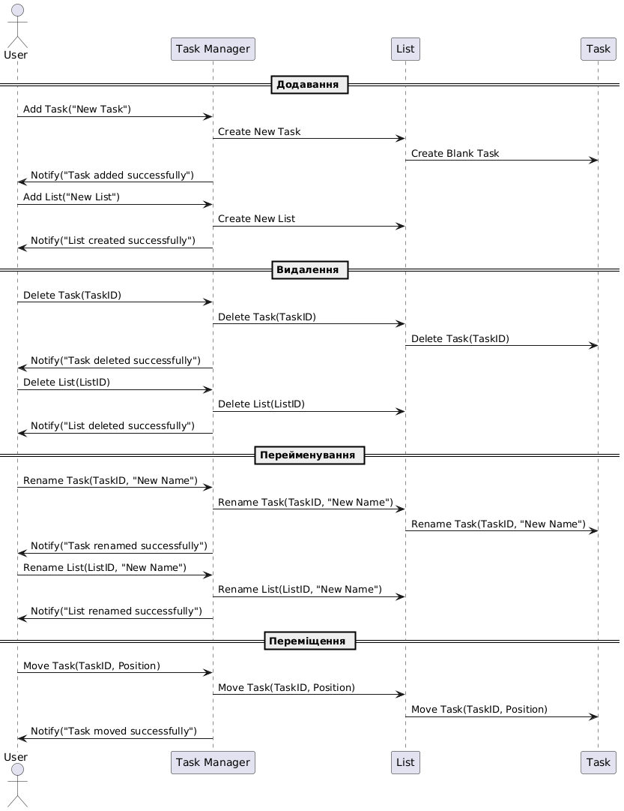

<h1 align="center" style="font-size: 46px;">Task Manager</h1>

# Опис

Цей проєкт є веб-додатком для управління завданнями, що підтримує створення списків, додавання, редагування, переміщення та видалення задач.

## Функціональність

- **1. Додавання завдань**
- **2. Редагування завдань**
- **3. Переміщення завдань між списками**
- **4. Видалення завдань та списків**
- **5. Збереження даних у локальному сховищі**

## Технології

- **HTML** – структура сторінки
- **CSS** – стилізація інтерфейсу
- **JavaScript** – функціональність додатку

## Додатково

- **Проєкт використовує GitHub Actions для запуску статичних аналізів та тестування коду.**
- **Було розроблено необхідні [UML-діаграми](PlantUML/), перевірені в PlantUML**
- **Було розроблено [специфікацію обмежень](Alloy/) для системи**
- **Розроблено модель якості додатку та визначено ключові метрики якості коду**

## 🔗 [Перейти на сайт](https://skorpikfeed.github.io/Task-Manager/)

# Модель якості додатку

## 1. Вступ

Даний документ описує модель якості додатку на основі стандартів ISO/IEC 25010 та ISO/IEC 25019:2023. Він визначає ключові характеристики якості, а також відповідні метрики для їх оцінювання.

## 2. Характеристики якості (ISO/IEC 25010)

### 2.1 Функціональна придатність

- **Повнота функцій** – Додаток повинен дозволяти CRUD-операції з задачами.
- **Правильність** – Функціонал працює згідно зі специфікацією.
- **Зручність використання** – Інтуїтивний інтерфейс для управління задачами.

### 2.2 Продуктивність та ефективність

- **Час відгуку** – Переміщення та редагування задач не повинні перевищувати 200 мс.
- **Споживання ресурсів** – Використання пам’яті та CPU при виконанні операцій не перевищує 20% доступного.

### 2.3 Зручність використання

- **Зрозумілість** – Користувач має інтуїтивно розуміти, як створити чи змінити задачу.

### 2.4 Надійність

- **Толерантність до збоїв** – Система коректно обробляє помилки.
- **Відновлюваність** – Час, необхідний для відновлення після збою.

### 2.5 Супроводжуваність

- **Читаємість коду** – Код має бути добре структурованим та відповідати стандартам SonarQube.
- **Тестованість** – Покриття тестами не менше 80%.

### 2.6 Портативність

- **Кросбраузерність** – Підтримка Chrome, Firefox, Edge.
- **Адаптивність** – Коректне відображення на мобільних пристроях.

## 3. Метрики якості коду

| Категорія          | Метрика                     | Опис                                                   |
| ------------------ | --------------------------- | ------------------------------------------------------ |
| Читабельність коду | Кількість коментарів (%)    | Співвідношення коментарів до загального коду           |
| Читабельність коду | Середня довжина функцій     | Оптимальний розмір функцій (в рядках коду)             |
| Надійність         | Покриття тестами (%)        | Відсоток покриття коду тестами                         |
| Надійність         | Кількість критичних помилок | Кількість помилок, що впливають на основний функціонал |
| Продуктивність     | Час відгуку (мс)            | Час відповіді додатку на запити                        |
| Продуктивність     | Використання пам'яті (МБ)   | Обсяг використаної пам'яті додатком                    |

# UML Діаграми

## Діаграма випадків використання

[Переглянути код](PlantUML/useCase.uml)

## Діаграма класів

[Переглянути код](PlantUML/classes.uml)

## Діаграма послідовності

[Переглянути код](PlantUML/sequence.uml)

